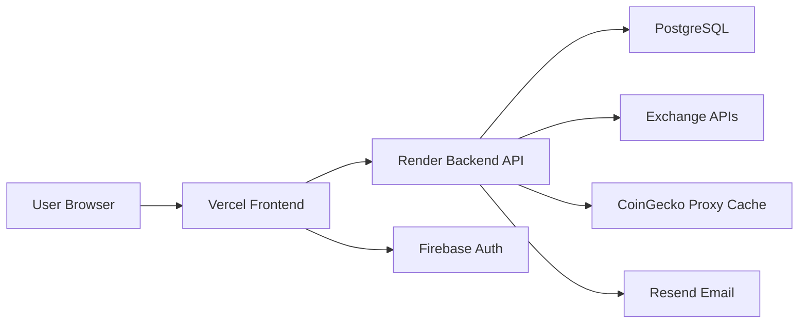

<div align="center">

# CryptoTrack

**A full-stack crypto portfolio platform for tracking holdings, monitoring live markets, syncing exchange activity, managing alerts, and following crypto news from one unified dashboard.**

[Explore the Live App](https://crypto-zip-fresh-chi.vercel.app)

[Live Frontend](https://crypto-zip-fresh-chi.vercel.app) · [Backend API](https://crypto-zip-fresh.onrender.com) · [Report Bug](https://github.com/prakyath-shetty/crypto-zip-fresh/issues) · [Request Feature](https://github.com/prakyath-shetty/crypto-zip-fresh/issues)


</div>

---

## Table of Contents

<details>
<summary>Click to expand</summary>

- [About The Project](#about-the-project)
- [Built With](#built-with)
- [Key Features](#key-features)
- [System Architecture](#system-architecture)
- [Getting Started](#getting-started)
- [Deployment](#deployment)
- [API Overview](#api-overview)
- [Contact](#contact)

</details>

---

## About The Project

Managing crypto assets across exchanges and tools often becomes fragmented. Holdings, transactions, watchlists, alerts, and market data usually live in separate products, which makes tracking portfolio performance harder than it should be.

CryptoTrack was built to bring these workflows together into a single product experience. The platform combines portfolio monitoring, exchange-aware history, watchlist tracking, market data, alerts, and crypto news in one place with a clean dashboard-first interface.

### Why this project stands out

- **Unified Portfolio Workflow:** Holdings, transactions, exchange sync, alerts, and market monitoring are accessible from one product.
- **Exchange-Aware Data Flow:** Portfolio and history views are designed around a selected exchange workflow rather than disconnected manual screens.
- **Resilient Market Data Layer:** CoinGecko requests are routed through a cached backend proxy to reduce direct rate-limit problems on the frontend.
- **Production Deployment Setup:** Frontend and backend are already structured for Vercel and Render deployment.

---

## Built With

This project uses a clean frontend-backend architecture designed for deployment and ongoing iteration.

### Frontend

- 
- 
- 

### Backend

- 
- 
- 

### Cloud and Infrastructure

- 
- 
- 
- 

---

## Key Features

| Module | Capabilities |
| --- | --- |
| Dashboard | Portfolio overview, market metrics, allocation insights, recent transactions, performance widgets |
| Portfolio | Connect exchange accounts, fetch holdings, filter by selected exchange, review asset allocation |
| Transaction History | Sync exchange trades, filter history, export transaction data |
| Live Market | Monitor market stats, price movement, gainers and losers |
| Watchlist | Track selected coins with sparkline movement and quick actions |
| Alerts | Create and manage price alerts with backend-driven live checks |
| News | Browse crypto headlines and category-based market news |
| Authentication | Email/password auth, Firebase Google sign-in, profile and account settings |

Additional highlights:

- Cached backend market proxy for CoinGecko requests
- Resend-based email delivery for alert and account flows
- PostgreSQL-backed user, holdings, transactions, and alert storage

---

## System Architecture



---

## Getting Started

To run the project locally, set up the backend first and then the frontend.

### Prerequisites

- Node.js v18+
- PostgreSQL database
- Firebase project
- Resend account

### 1. Clone the repository

```bash
git clone https://github.com/prakyath-shetty/crypto-zip-fresh.git
cd crypto-zip-fresh
```

### 2. Backend setup

```bash
cd backend
npm install
```

Create a `.env` file in `backend/`:

```env
PORT=10000
DATABASE_URL=<your_postgresql_connection_string>
JWT_SECRET=<your_jwt_secret>
JWT_EXPIRE=7d
FRONTEND_URL=http://localhost:5500
CLIENT_URLS=http://localhost:5500,http://127.0.0.1:5500
RESEND_API_KEY=<your_resend_api_key>
RESEND_FROM_EMAIL=<your_verified_sender>
NEWSDATA_API_KEY=<your_newsdata_api_key>
```

Run the backend:

```bash
npm start
```

### 3. Frontend setup

```bash
cd ../frontend
npm install
npm run build
```

Set frontend environment values in your deployment setup:

```env
FRONTEND_API_ORIGIN=http://localhost:5000
FRONTEND_PUBLIC_URL=http://localhost:5500
FIREBASE_API_KEY=<your_firebase_api_key>
FIREBASE_AUTH_DOMAIN=<your_firebase_auth_domain>
FIREBASE_PROJECT_ID=<your_firebase_project_id>
FIREBASE_STORAGE_BUCKET=<your_firebase_storage_bucket>
FIREBASE_MESSAGING_SENDER_ID=<your_firebase_sender_id>
FIREBASE_APP_ID=<your_firebase_app_id>
FIREBASE_MEASUREMENT_ID=<your_firebase_measurement_id>
```

---

## Deployment

### Frontend on Vercel

- Root Directory: `frontend`
- Install Command: `npm install`
- Build Command: `npm run build`
- Output Directory: `dist`

Recommended environment variables:

```env
FRONTEND_API_ORIGIN=https://crypto-zip-fresh.onrender.com
FRONTEND_PUBLIC_URL=https://crypto-zip-fresh-chi.vercel.app
FIREBASE_API_KEY=<your_firebase_api_key>
FIREBASE_AUTH_DOMAIN=<your_firebase_auth_domain>
FIREBASE_PROJECT_ID=<your_firebase_project_id>
FIREBASE_STORAGE_BUCKET=<your_firebase_storage_bucket>
FIREBASE_MESSAGING_SENDER_ID=<your_firebase_sender_id>
FIREBASE_APP_ID=<your_firebase_app_id>
FIREBASE_MEASUREMENT_ID=<your_firebase_measurement_id>
```

### Backend on Render

- Root Directory: `backend`
- Build Command: `npm install`
- Start Command: `npm start`

Recommended environment variables:

```env
PORT=10000
DATABASE_URL=<your_postgresql_connection_string>
JWT_SECRET=<your_jwt_secret>
JWT_EXPIRE=7d
FRONTEND_URL=https://crypto-zip-fresh-chi.vercel.app
CLIENT_URLS=https://crypto-zip-fresh-chi.vercel.app,http://localhost:5500,http://127.0.0.1:5500
RESEND_API_KEY=<your_resend_api_key>
RESEND_FROM_EMAIL=<your_verified_sender>
NEWSDATA_API_KEY=<your_newsdata_api_key>
```

---

## API Overview

Main backend route groups:

- `/api/auth`
- `/api/profile`
- `/api/exchange`
- `/api/transactions`
- `/api/holdings`
- `/api/alerts`
- `/api/market`
- `/api/news`
- `/api/watchlist`
- `/api/wallet`

---

## Contact

Prakyath Shetty

- GitHub: [@prakyath-shetty](https://github.com/prakyath-shetty)
- Project Repository: [crypto-zip-fresh](https://github.com/prakyath-shetty/crypto-zip-fresh)
