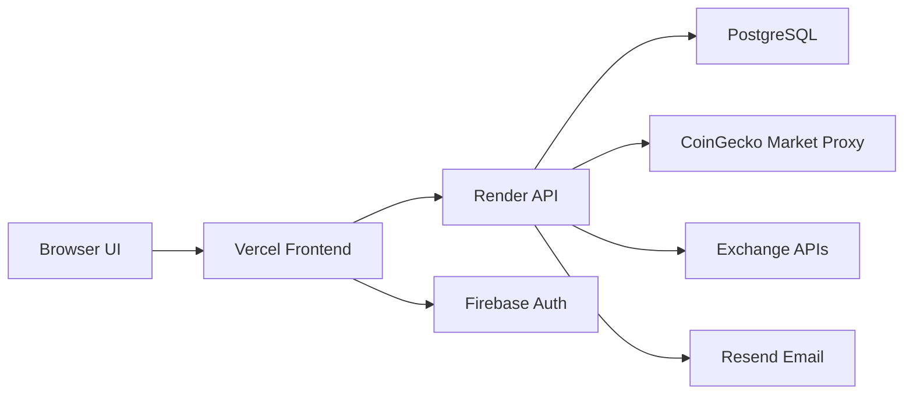

# CryptoTrack


CryptoTrack is a full-stack crypto portfolio platform built for monitoring holdings, syncing exchange activity, tracking transactions, managing watchlists, and following live market movement from a single dashboard.

## Live Project

- Frontend: [https://crypto-zip-fresh-chi.vercel.app](https://crypto-zip-fresh-chi.vercel.app)
- Backend: [https://crypto-zip-fresh.onrender.com](https://crypto-zip-fresh.onrender.com)

## Highlights

- Portfolio dashboard with holdings, allocation, and performance insights
- Exchange integration flow for syncing balances and trade history
- Transaction history with exchange-aware filtering
- Watchlist and live market monitoring
- Price alerts and crypto news feed
- Email/password auth with Firebase-based Google sign-in
- PostgreSQL-backed user, wallet, holdings, and alert data

## Tech Stack

- Frontend: HTML, CSS, JavaScript
- Backend: Node.js, Express
- Database: PostgreSQL
- Auth: JWT, Firebase Authentication
- Email: Resend
- Market data: CoinGecko via backend market proxy
- Deployment: Vercel and Render

## Architecture



## Project Structure

- `frontend/` static client application and production build source
- `backend/` Express API, auth, exchange logic, alerts, and database access

## Core Modules

### Frontend

- `frontend/index.html` login entry point
- `frontend/pages/dashboard.html` portfolio and market overview
- `frontend/pages/portfolio.html` exchange connection and holdings view
- `frontend/pages/history.html` transaction history and exchange sync
- `frontend/pages/market.html` live market tracker
- `frontend/pages/watchlist.html` watchlist monitoring
- `frontend/crypto-api.js` shared API connector

### Backend

- `backend/server.js` API bootstrap and route registration
- `backend/routes/auth.js` authentication routes
- `backend/routes/exchange.js` exchange connection, portfolio, and trade sync
- `backend/routes/transactions_route.js` transaction data APIs
- `backend/routes/market_route.js` cached CoinGecko proxy routes
- `backend/routes/alerts_route.js` alert management and price checks

## API Overview

Main route groups:

- `/api/auth` authentication and account session endpoints
- `/api/exchange` exchange connection, portfolio, and trade sync endpoints
- `/api/transactions` transaction history endpoints
- `/api/holdings` holdings management endpoints
- `/api/alerts` alert management and live price checks
- `/api/market` cached market-data proxy endpoints
- `/api/news` news feed and newsletter endpoints
- `/api/profile` profile and account settings endpoints

## Frontend Deployment

Deploy the frontend on Vercel with:

- Root Directory: `frontend`
- Install Command: `npm install`
- Build Command: `npm run build`
- Output Directory: `dist`

Environment variables:

```env
FRONTEND_API_ORIGIN=https://crypto-zip-fresh.onrender.com
FRONTEND_PUBLIC_URL=https://crypto-zip-fresh-chi.vercel.app
FIREBASE_API_KEY=replace_with_your_firebase_api_key
FIREBASE_AUTH_DOMAIN=replace_with_your_firebase_auth_domain
FIREBASE_PROJECT_ID=replace_with_your_firebase_project_id
FIREBASE_STORAGE_BUCKET=replace_with_your_firebase_storage_bucket
FIREBASE_MESSAGING_SENDER_ID=replace_with_your_firebase_sender_id
FIREBASE_APP_ID=replace_with_your_firebase_app_id
FIREBASE_MEASUREMENT_ID=replace_with_your_firebase_measurement_id
```

## Backend Deployment

Deploy the backend on Render with:

- Root Directory: `backend`
- Build Command: `npm install`
- Start Command: `npm start`

Environment variables:

```env
PORT=10000
DATABASE_URL=replace_with_your_database_url
JWT_SECRET=replace_with_your_jwt_secret
JWT_EXPIRE=7d
FRONTEND_URL=https://crypto-zip-fresh-chi.vercel.app
CLIENT_URLS=https://crypto-zip-fresh-chi.vercel.app,http://localhost:5500,http://127.0.0.1:5500
RESEND_API_KEY=replace_with_your_resend_api_key
RESEND_FROM_EMAIL=replace_with_your_verified_sender
NEWSDATA_API_KEY=replace_with_your_newsdata_api_key
```

## Local Development

### Frontend

```bash
cd frontend
npm install
npm run build
```

### Backend

```bash
cd backend
npm install
npm start
```

## Roadmap

- Expand exchange coverage and sync depth
- Improve portfolio analytics and P&L reporting
- Add richer demo data mode for testing without exchange accounts
- Improve market-data caching and resilience further

## License

This project is intended for personal and portfolio use unless you choose to add your own license.
