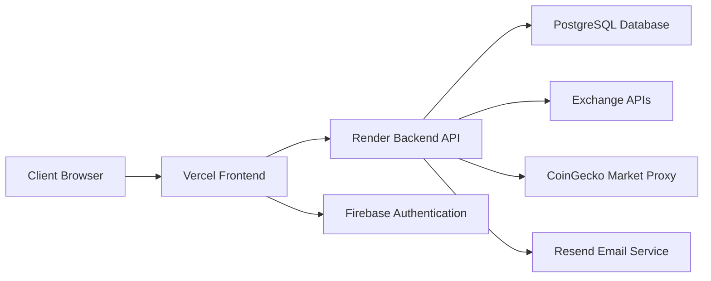

# CryptoTrack
MIT License

CryptoTrack is a full-stack crypto portfolio management platform built to help users monitor holdings, sync exchange activity, track transactions, create price alerts, manage watchlists, and follow live market movement from one unified dashboard.

[Explore the Live App](https://crypto-zip-fresh-chi.vercel.app)

[Frontend Live](https://crypto-zip-fresh-chi.vercel.app) · [Backend API](https://crypto-zip-fresh.onrender.com) · [Report Bug](https://github.com/prakyath-shetty/crypto-zip-fresh/issues) · [Request Feature](https://github.com/prakyath-shetty/crypto-zip-fresh/issues)

## Table of Contents

- [About The Project](#about-the-project)
- [Built With](#built-with)
- [Key Features](#key-features)
- [System Architecture](#system-architecture)
- [Getting Started](#getting-started)
- [Deployment](#deployment)
- [API Overview](#api-overview)
- [Contact](#contact)

## About The Project

Managing crypto portfolios across multiple platforms can quickly become fragmented. Prices change constantly, exchange balances are spread across different apps, and keeping track of transactions, alerts, and holdings manually is inefficient.

CryptoTrack was designed as a modern portfolio platform that brings these workflows together into a single experience. Users can manage their profile, connect exchanges, monitor live market data, review holdings and transaction history, build a watchlist, and stay updated with crypto news from one dashboard-driven application.

### Why this project stands out

- Exchange-aware portfolio tracking with holdings and sync-ready transaction history
- Dedicated dashboard for portfolio insights, market metrics, and allocation views
- Built-in watchlist, alerts, and crypto news workflow
- Firebase-powered Google sign-in alongside email/password authentication
- Cached backend market proxy to reduce direct CoinGecko rate-limit issues

## Built With

This project uses a deployment-ready frontend and backend architecture designed for real-world hosting.

### Frontend

- HTML
- CSS
- JavaScript

### Backend

- Node.js
- Express
- PostgreSQL

### Cloud and Infrastructure

- Firebase Authentication
- Resend
- Vercel
- Render

## Key Features

| Area | Capabilities |
| --- | --- |
| Dashboard | Portfolio overview, market stats, allocation insights, recent transactions, performance widgets |
| Portfolio | Connect exchange accounts, fetch holdings, filter by selected exchange, review allocation and asset details |
| Transactions | View transaction history, sync exchange trades, filter by transaction type and exchange |
| Watchlist | Add and monitor coins, follow sparkline movement, track daily gainers and losers |
| Alerts | Create price alerts, manage status, trigger notifications, review alert activity |
| News | Browse crypto news categories and market-related headlines |
| Authentication | Email/password login, Firebase Google sign-in, profile and session management |

## System Architecture



## Getting Started

To run the project locally, set up the backend first and then the frontend.

### Prerequisites

- Node.js v18+
- PostgreSQL database
- Firebase project for Google authentication
- Resend account for email delivery

### Local Installation

Clone the repository:

```bash
git clone https://github.com/prakyath-shetty/crypto-zip-fresh.git
cd crypto-zip-fresh
```

### Backend Setup

```bash
cd backend
npm install
```

Create a `.env` file in `backend/`:

```env
PORT=10000
DATABASE_URL=<your_postgresql_connection_string>
JWT_SECRET=<your_jwt_secret>
JWT_EXPIRE=7d
FRONTEND_URL=http://localhost:5500
CLIENT_URLS=http://localhost:5500,http://127.0.0.1:5500
RESEND_API_KEY=<your_resend_api_key>
RESEND_FROM_EMAIL=<your_verified_sender>
NEWSDATA_API_KEY=<your_newsdata_api_key>
```

Run the backend:

```bash
npm start
```

### Frontend Setup

```bash
cd ../frontend
npm install
```

Create frontend environment variables in your hosting setup or use them during build:

```env
FRONTEND_API_ORIGIN=http://localhost:5000
FRONTEND_PUBLIC_URL=http://localhost:5500
FIREBASE_API_KEY=<your_firebase_api_key>
FIREBASE_AUTH_DOMAIN=<your_firebase_auth_domain>
FIREBASE_PROJECT_ID=<your_firebase_project_id>
FIREBASE_STORAGE_BUCKET=<your_firebase_storage_bucket>
FIREBASE_MESSAGING_SENDER_ID=<your_firebase_sender_id>
FIREBASE_APP_ID=<your_firebase_app_id>
FIREBASE_MEASUREMENT_ID=<your_firebase_measurement_id>
```

Build the frontend:

```bash
npm run build
```

## Deployment

### Frontend on Vercel

- Root Directory: `frontend`
- Install Command: `npm install`
- Build Command: `npm run build`
- Output Directory: `dist`

Recommended environment variables:

```env
FRONTEND_API_ORIGIN=https://crypto-zip-fresh.onrender.com
FRONTEND_PUBLIC_URL=https://crypto-zip-fresh-chi.vercel.app
FIREBASE_API_KEY=<your_firebase_api_key>
FIREBASE_AUTH_DOMAIN=<your_firebase_auth_domain>
FIREBASE_PROJECT_ID=<your_firebase_project_id>
FIREBASE_STORAGE_BUCKET=<your_firebase_storage_bucket>
FIREBASE_MESSAGING_SENDER_ID=<your_firebase_sender_id>
FIREBASE_APP_ID=<your_firebase_app_id>
FIREBASE_MEASUREMENT_ID=<your_firebase_measurement_id>
```

### Backend on Render

- Root Directory: `backend`
- Build Command: `npm install`
- Start Command: `npm start`

Recommended environment variables:

```env
PORT=10000
DATABASE_URL=<your_postgresql_connection_string>
JWT_SECRET=<your_jwt_secret>
JWT_EXPIRE=7d
FRONTEND_URL=https://crypto-zip-fresh-chi.vercel.app
CLIENT_URLS=https://crypto-zip-fresh-chi.vercel.app,http://localhost:5500,http://127.0.0.1:5500
RESEND_API_KEY=<your_resend_api_key>
RESEND_FROM_EMAIL=<your_verified_sender>
NEWSDATA_API_KEY=<your_newsdata_api_key>
```

## API Overview

Main route groups exposed by the backend:

- `/api/auth`
- `/api/profile`
- `/api/exchange`
- `/api/transactions`
- `/api/holdings`
- `/api/alerts`
- `/api/market`
- `/api/news`
- `/api/watchlist`
- `/api/wallet`

## Contact

Prakyath Shetty

- GitHub: [@prakyath-shetty](https://github.com/prakyath-shetty)
- Project Repository: [crypto-zip-fresh](https://github.com/prakyath-shetty/crypto-zip-fresh)
